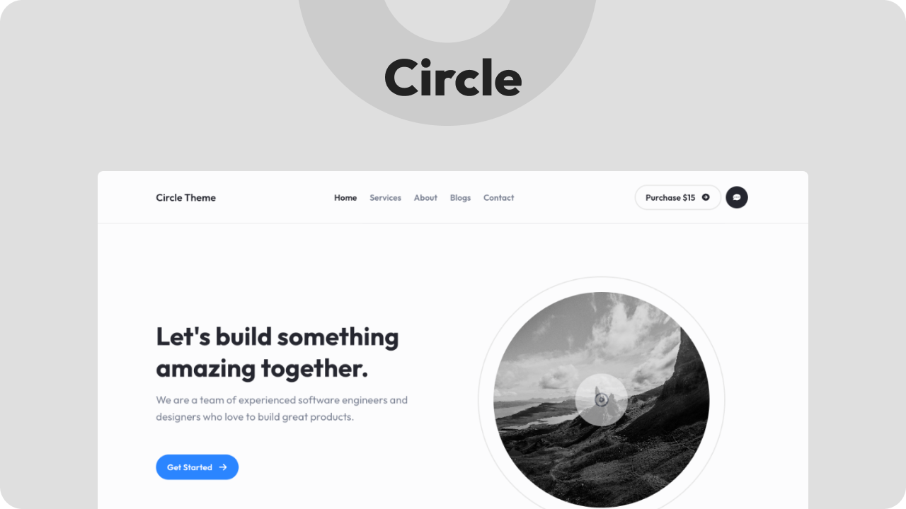

# Circle - React Creative Template

Circle is a React Creative Template. It is a modern, clean and professional template. It helps you to make your own site. It is suitable for any startup business, companies, agencies, and freelancers which need a professional way to showcase their projects and services with 100% super responsive experience.

Circle theme is going through a lot of changes. We are adding new components and features to it. You can check the [Changelog](./CHANGELOG.md) to see what's new. There might be some breaking changes in the future as the theme is still new and in development. There will be a proper roadmap for the theme soon. Till then, you can check the [Todo](#todo) section and list of components below.

## Demo

## Installation

- Clone the repo: `git clone https://github.com/Unmaad-Studio/Circle-React-Theme.git`
- Go to the project folder: `cd Circle-React-Theme`
- Install packages: `npm install`
- Start the project: `npm start`

## Todo

- [ ] Add images to all README.md files
- [ ] Capability to add background to [PageSection]

## Changelog

[Browse the changelog](./CHANGELOG.md)

## Components List

- [x] [Card](./src/components/Card/) - [Added in 1.1.0]
- [x] ~~Blog Card~~ - [Removed - Replaced with Card]
- [x] [Cta Box](./src/components/CtaBox/)
- [ ] Feature Box - [Pro Version, Not Available Yet]
- [x] [Icon Card](./src/components/IconCard/)
- [x] [Logo Carousel](./src/components/LogoCarousel/)
- [x] ~~Work Card~~ - [Removed - Replaced with Card]
- [x] [Work Categories](./src/components/WorkCategories/)
- [x] [Team Member Card](./src/components/TeamMemberCard/)
- [x] [Section Header](./src/components/SectionHeader/)
- [ ] Testimonial Card - [Pro Version, Not Available Yet]
- [x] [Pricing Card](./src/components/PricingCard/)
- [ ] Pricing Table - [Pro Version, Not Available Yet]
- [x] [FAQ Accordion](./src/components/FaqAccordion/)

## Sections List

- [x] [Intro Section](./src/sections/IntroSection/) // TODO: Rename to Hero Section
- [ ] Hero 2 Section - [Pro Version - Not Available Yet]
- [x] [Header Section](./src/sections/HeaderSection/)
- [x] [Footer Section](./src/sections/FooterSection/)
- [ ] Works Section - [Pro Version - Not Available Yet]

## Layouts List

- [x] [Page Container](./src/layouts/PageContainer.tsx)
- [x] [Page Section](./src/layouts/PageSection.tsx)
- [x] [Grid Container](./src/layouts/GridContainer.tsx)
- [x] [Typography Container](./src/layouts/TypographyContainer.tsx)

## Pages List

- [x] [Home](./src/pages/HomePage/)
- [x] [About](./src/pages/AboutPage/)
- [x] [Services](./src/pages/ServicesPage/)
- [ ] Works - [Pro Version - Not Available Yet]
- [ ] Work Single - [Pro Version - Not Available Yet]
- [x] [Blogs](./src/pages/BlogsPage/)
- [x] [Blog Single](./src/pages/BlogSinglePage/)
- [x] [Contact](./src/pages/ContactPage/)
- [x] [404](./src/pages/NotFoundPage/)
- [ ] Documentation - [Pro Version - Not Available Yet]

## Widgets

- [x] [Button](./src/widgets/Button/)
- [x] [Icon Button](./src/widgets/IconButton/)
- [x] [Theme Switcher](./src/widgets/ThemeSwitcher/)
- [x] [Spacer](./src/widgets/Spacer/)
- [x] [Seperator](./src/widgets/Seperator/)
- [ ] Social Icons - TODO

## Dialogs

- [ ] Subscribe - [Pro Version - Not Available Yet]
- [ ] Contact Form - [Pro Version - Not Available Yet]

## Credits

- [React](https://reactjs.org/)
- [React Router](https://reacttraining.com/react-router/)
- [React Icons](https://react-icons.netlify.com/#/)

## License

[MIT](./LICENSE) © [Unmaad Studio](https://unmaad.studio)

## More

Stay tuned for more updates.
